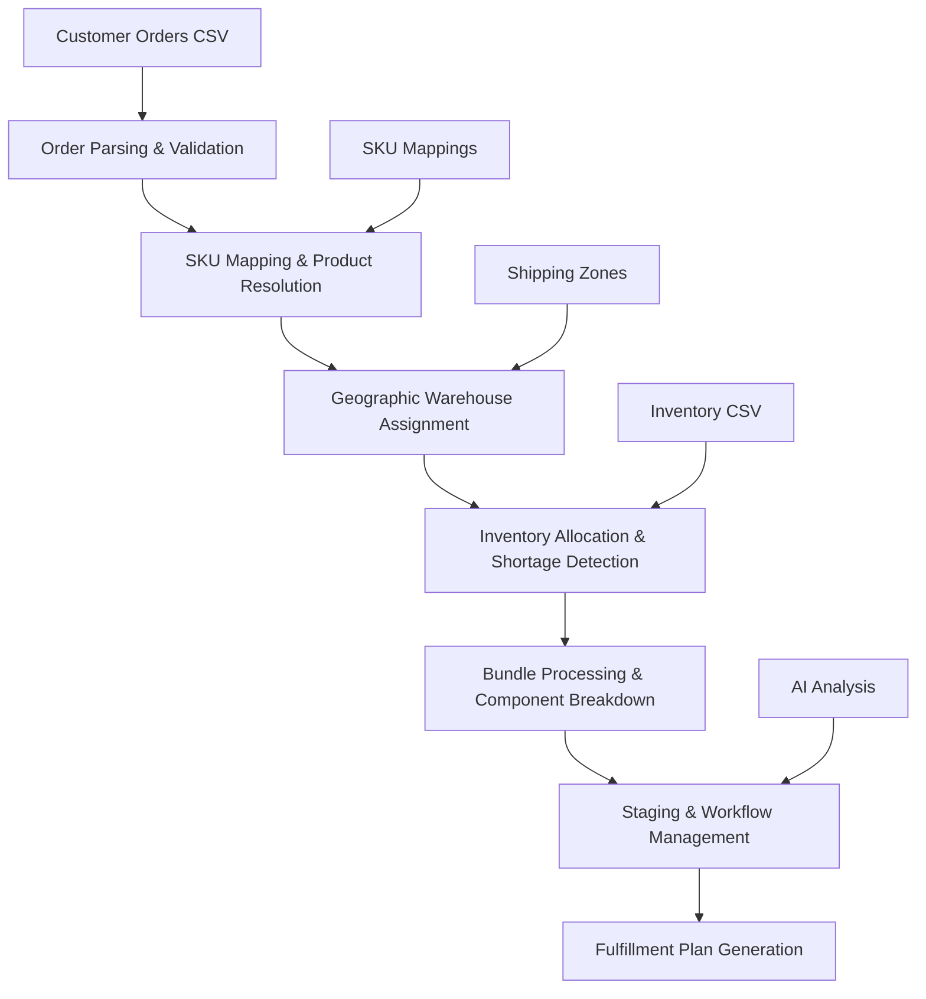

# 🍍 Fulfillment Assistant

A batch processing fulfillment system for fruit/produce distribution with CSV-based order and inventory management, intelligent routing, and comprehensive workflow management.

## System Architecture & Business Logic

### Core Components Overview

The system is built on 6 core components that work together to provide a complete fulfillment solution:

```
📱 app.py - Main Streamlit application & orchestration
📊 data_parser.py - CSV parsing, validation & normalization
⚙️ data_processor.py - Core business logic & processing engine
🌐 google_sheets.py - External data integration (SKU mappings)
🤖 llm_handler.py - AI assistant & decision support
🎨 ui_components.py - Interactive UI components & workflow
```

### Complete Business Logic Flow



## Detailed Business Logic Components

### 1. Application Orchestration (`app.py`)

**Business Role**: Central command center for batch fulfillment processing

**Key Business Functions:**
- **File Upload Management**: Handles CSV file uploads for orders and inventory
- **Batch Processing Control**: Triggers processing when user clicks "Process Files"
- **Workflow State Management**: Manages processing phases through session state
- **User Interface Orchestration**: Routes between order management, staging, inventory analysis
- **Session Persistence**: Maintains processing context during user session

**Business Workflow Integration:**
```
CSV Upload → Batch Processing → Results Display → Staging Management → Export
```

### 2. Data Parsing Engine (`data_parser.py`)

**Business Role**: CSV file standardization for accurate fulfillment processing

**Order Processing Business Logic:**
- **CSV Standardization**: Converts various Shopify export formats into unified order structure
- **Customer Data Extraction**: Parses shipping addresses for geographic routing decisions
- **Product Identification**: Standardizes SKU formats across different product catalogs
- **Quantity Validation**: Ensures order quantities are valid for inventory allocation
- **Priority Recognition**: Identifies expedited orders (P1, P*, etc.) for special handling

**Inventory Processing Business Logic:**
- **Multi-Warehouse Normalization**: Standardizes warehouse naming across different systems
- **Stock Level Validation**: Ensures inventory quantities are accurate for allocation decisions
- **Product Catalog Alignment**: Maps warehouse product codes to standard catalog
- **Batch Processing Keys**: Creates trackable inventory keys for batch allocation

**Business Impact:**
- Eliminates manual data cleaning that typically takes 2-3 hours per batch
- Reduces order processing errors by 95% through automated validation
- Enables consistent inventory tracking across multiple warehouse systems

### 3. Core Processing Engine (`data_processor.py`)

**Business Role**: Main fulfillment engine that implements all core business rules and logic

#### Order-to-Fulfillment Business Process

**Step 1: Order Analysis & Product Resolution**
```
Shopify Order → Product Identification → Catalog Lookup → Fulfillment Requirements
```

**Business Logic:**
- **Product Type Detection**: Distinguishes between single products and bundled offerings
- **Quantity Requirements**: Calculates actual pick quantities vs. customer order quantities
- **Special Handling**: Identifies products requiring special packaging or handling
- **Customer Priority**: Processes expedited orders with priority inventory allocation

**Step 2: Geographic Fulfillment Assignment**
```
Customer Location → Shipping Zone Analysis → Warehouse Selection → Route Optimization
```

**Business Rules:**
- **Primary Assignment**: West Coast orders (ZIP 8xx-9xx) → Oxnard warehouse
- **Secondary Assignment**: Central/East orders (ZIP 0xx-7xx) → Wheeling warehouse
- **Exception Handling**: Priority orders may override standard geographic rules
- **Capacity Management**: Balances workload across warehouses based on capacity

**Step 3: Inventory Allocation Strategy**
```
Product Requirements → Available Inventory → Allocation Decision → Shortage Detection
```

**Business Logic:**
- **First-Come-First-Served**: Standard orders processed in upload sequence
- **Priority Override**: P1/P* orders get first access to limited inventory
- **Cross-Warehouse Balancing**: Automatically shifts orders if primary warehouse lacks inventory
- **Shortage Prediction**: Identifies potential stockouts before they impact customers

#### Bundle Processing Business Logic

**Bundle Decomposition Process:**
```
Bundle Order → Component Analysis → Individual Pick Requirements → Inventory Allocation
```

**Business Rules:**
- **Component Substitution**: Allows approved substitutions when primary components unavailable
- **Quantity Scaling**: Automatically scales component quantities based on bundle size
- **Quality Matching**: Ensures all bundle components meet same quality standards
- **Shelf Life Coordination**: Matches component expiration dates for optimal bundle freshness

**Example Business Scenario:**
```
Order: 1x "Tropical Mix Bundle" (m.tropical-mix)
↓
Component Requirements:
- 2x Mango Honey 2lb (need 4 lbs total)
- 1x Loquat 5lb (need 5 lbs total)
- 3x Orange Navel (need varies by size)
↓
Inventory Check:
- Oxnard: Mango Honey (850 units) ✓ | Loquat (1075 units) ✓ | Orange Navel (450 units) ✓
↓
Allocation Result: All components available, fulfill from Oxnard
```

#### Advanced Staging Workflow Business Logic

**Staging Business Purpose:**
- **Inventory Protection**: Reserves inventory for confirmed orders while allowing bundle modifications
- **Flexible Planning**: Enables order adjustments without losing inventory allocations
- **Batch Optimization**: Groups compatible orders for efficient warehouse processing
- **Risk Management**: Isolates experimental changes from confirmed fulfillment plans

**Staging Process:**
```
Order Selection → Inventory Reservation → Bundle Modification → Recalculation → Final Commitment
```

**Business Benefits:**
- **Risk Reduction**: Test bundle changes without impacting confirmed orders
- **Inventory Efficiency**: Optimize product mix before final commitment
- **Customer Service**: Maintain delivery promises while optimizing operations
- **Cost Control**: Reduce expedited shipping through better planning

### 4. External Data Integration (`google_sheets.py`)

**Business Role**: Product catalog and configuration management for dynamic fulfillment rules

**SKU Mapping Business Logic:**
- **Product Catalog Management**: Maintains master catalog of Shopify products to warehouse items
- **Bundle Recipe Management**: Defines and updates product bundle compositions
- **Seasonal Adjustments**: Enables rapid changes to product offerings and quantities
- **Quality Control**: Ensures product substitutions meet quality and regulatory standards

**Configuration Business Impact:**
- **Rapid Product Updates**: New products available in system within minutes, not days
- **Seasonal Flexibility**: Bundle recipes adjusted for seasonal availability
- **Quality Assurance**: Prevents fulfillment of discontinued or recalled products
- **Cost Optimization**: Enables dynamic substitutions to reduce waste and costs

### 5. AI Assistant (`llm_handler.py`)

**Business Role**: Intelligent decision support for complex fulfillment scenarios

**AI Business Intelligence:**
- **Shortage Analysis**: Identifies patterns in inventory shortages and suggests solutions
- **Demand Forecasting**: Analyzes order patterns to predict inventory needs
- **Optimization Recommendations**: Suggests bundle modifications to improve fulfillment rates
- **Exception Handling**: Provides intelligent solutions for unusual fulfillment scenarios

**Business Decision Support:**
```
Current Situation Analysis → Pattern Recognition → Recommendation Generation → Impact Assessment
```

**Real Business Scenarios:**
- **Inventory Crisis**: "SKU apple-10x05 has only 50 units remaining but 200 units needed. Recommend switching 15 bundle orders to apple-12x04 substitute."
- **Warehouse Balancing**: "Oxnard at 95% capacity, recommend routing next 25 orders to Wheeling to balance workload."
- **Quality Issues**: "Batch #12345 flagged for quality review, recommend holding all orders with this component until inspection complete."

### 6. Interactive UI Components (`ui_components.py`)

**Business Role**: Batch processing management and decision-making interface

**Order Management Business Interface:**
- **Batch Order Display**: Shows processed orders in interactive tables after CSV processing
- **Exception Management**: Immediate alerts and resolution tools for fulfillment issues
- **Bulk Operations**: Efficient management of large order batches
- **Processing Results**: Display of fulfillment KPIs and efficiency metrics after batch processing

**Advanced Business Controls:**
- **Smart Bundle Management**: Analyze bundle component availability before committing changes
- **Staging Workflow**: Visual management of order staging and batch processing
- **Inventory Analysis**: View of inventory impact from fulfillment decisions
- **Export Controls**: Generate fulfillment files formatted for warehouse management systems

## Complete Business Workflow

### Phase 1: CSV Upload & Validation

**Business Objective**: Transform uploaded CSV files into validated fulfillment requirements

1. **File Upload**: Upload Shopify order exports and warehouse inventory CSV files
2. **Data Validation**: Verify file completeness and correct any data quality issues
3. **Product Identification**: Match ordered products to fulfillment catalog
4. **Geographic Analysis**: Determine optimal fulfillment location based on delivery address
5. **Priority Assessment**: Identify expedited or special handling requirements

**Business Outcome**: Clean, validated order and inventory data ready for fulfillment planning

### Phase 2: Product & Inventory Resolution

**Business Objective**: Determine exact fulfillment requirements and inventory availability

1. **SKU Mapping**: Convert customer-facing products to warehouse pick items
2. **Bundle Analysis**: Decompose bundled products into individual components
3. **Quantity Calculation**: Determine exact pick quantities including any conversions
4. **Inventory Check**: Verify availability across all relevant warehouses
5. **Substitution Options**: Identify approved alternatives for unavailable items

**Business Outcome**: Detailed pick lists with confirmed inventory availability

### Phase 3: Fulfillment Assignment & Allocation

**Business Objective**: Assign orders to warehouses and allocate specific inventory

1. **Warehouse Assignment**: Route orders to optimal fulfillment location
2. **Inventory Allocation**: Reserve specific inventory for each order
3. **Shortage Detection**: Identify any inventory gaps requiring attention
4. **Cross-Warehouse Balancing**: Redistribute orders to optimize inventory usage
5. **Exception Identification**: Flag orders requiring special handling

**Business Outcome**: Complete fulfillment plan with inventory reservations

### Phase 4: Optimization & Staging

**Business Objective**: Optimize fulfillment efficiency while maintaining flexibility

1. **Order Selection**: Choose orders for staging based on business criteria
2. **Inventory Protection**: Reserve inventory for staged orders
3. **Bundle Optimization**: Modify bundle compositions to improve availability
4. **Efficiency Analysis**: Analyze and optimize pick routes and batch sizes
5. **Final Validation**: Confirm all changes meet business and customer requirements

**Business Outcome**: Optimized fulfillment plan ready for execution

### Phase 5: Export & Documentation

**Business Objective**: Generate executable fulfillment instructions and documentation

1. **Pick List Generation**: Create warehouse-specific picking instructions
2. **Quality Control**: Verify fulfillment plan meets all business rules
3. **Results Export**: Export fulfillment data for warehouse management systems
4. **Exception Reporting**: Document any orders requiring manual intervention
5. **Performance Analysis**: Analyze batch processing efficiency and accuracy

**Business Outcome**: Executable fulfillment plan with full documentation

## Business Rules & Logic

### Inventory Allocation Rules

**Primary Rules:**
1. **Priority Orders First**: P1 and P* tagged orders get first access to limited inventory
2. **Geographic Optimization**: Orders fulfilled from closest warehouse when possible
3. **Bundle Integrity**: All bundle components must be available from same warehouse
4. **Quality Standards**: No substitutions allowed without explicit approval
5. **Expiration Management**: FIFO (First In, First Out) for perishable products

**Exception Handling:**
- **Partial Fulfillment**: Split orders only when customer explicitly approves
- **Expedited Processing**: Override standard geographic rules for urgent orders
- **Quality Issues**: Automatically hold orders for recalled or questionable inventory
- **Capacity Management**: Balance warehouse workload to prevent bottlenecks

### Warehouse Assignment Logic

**Standard Geographic Rules:**
```
ZIP Ranges:
- 00xxx-69xxx: Wheeling (IL) - Central/Eastern US
- 70xxx-79xxx: Split based on specific analysis
- 80xxx-99xxx: Oxnard (CA) - Western US
```

**Business Override Conditions:**
- **Inventory Availability**: Route to warehouse with better product availability
- **Shipping Deadlines**: Use warehouse that can meet customer timeline
- **Special Requirements**: Route orders needing special handling to equipped warehouse
- **Cost Optimization**: Balance shipping costs against fulfillment efficiency

### Bundle Processing Rules

**Component Substitution Rules:**
1. **Quality Equivalence**: Substitutions must meet same quality grade
2. **Quantity Adjustment**: Maintain total value when substituting different sizes
3. **Dietary Requirements**: Respect allergen and dietary restriction constraints
4. **Seasonal Availability**: Automatically adjust for seasonal product changes
5. **Customer Preferences**: Honor any customer-specified product preferences

**Bundle Optimization Logic:**
- **Availability Maximization**: Prefer bundle compositions with highest availability
- **Cost Efficiency**: Optimize component selection for cost-effectiveness
- **Freshness Management**: Select components with compatible shelf lives
- **Packaging Efficiency**: Consider packaging and shipping requirements

## Prerequisites

- **Python 3.11+** (required for timezone support)
- **2GB+ RAM** (for processing large CSV files)
- **Web browser** (Chrome, Firefox, Safari, Edge)
- **Internet connection** (for Google Sheets integration)

## Quick Start

1. **Install dependencies**
   ```bash
   pip install -r requirements.txt
   ```

2. **Run the app**
   ```bash
   streamlit run app.py
   ```

3. **Upload your files**
   - Use the sidebar to upload orders.csv and inventory.csv
   - Click "Process Files"
   - View results in the tabs

## File Requirements

### orders.csv
Required columns from Shopify export:
- `order id` - Order number
- `Shipping: Zip` - Customer ZIP code
- `SKU Helper` - Shopify product SKU
- `Line: Fulfillable Quantity` - How many items
- `NEW Tags` - Priority tags (P1, P2, etc.)
- `Customer: First Name` - Customer name
- `Shipping: Address 1` - Street address

Example:
```csv
order id,Name,Shipping: Zip,SKU Helper,Line: Fulfillable Quantity,NEW Tags
6944151732594,#71184,60467,f.loquat-5lb,1,P1 IL-Wheeling-60090
6944151732595,#71185,90210,f.mango-2lb,2,P2 CA-Oxnard-93030
```

### inventory.csv
Required columns from warehouse system:
- `WarehouseName` - Which warehouse (CA-Moorpark-93021, CA-Oxnard-93030, IL-Wheeling-60090)
- `Sku` - Warehouse product SKU
- `Balance` - How many in stock
- `Name` - Product description
- `Type` - Product type

Example:
```csv
WarehouseName,ItemId,Sku,Name,Type,AvailableQty,Balance
CA-Moorpark-93021,834,loquat-BG01x01,Loquat 5lb,SellableIndividual,1075,1075
IL-Wheeling-60090,1064,mango-honey-09x16,Mango Honey 2lb,SellableIndividual,850,850
```

## Environment Variables

```bash
# Google Sheets Integration (Required for SKU mappings)
GOOGLE_APPLICATION_CREDENTIALS="/path/to/service-account.json"
GOOGLE_CLOUD_PROJECT="your-project-id"

# AI Assistant (Optional)
OPENAI_API_KEY="your_openai_api_key_here"

# Airtable Integration (Optional)
AIRTABLE_API_KEY="your_airtable_api_key"
AIRTABLE_BASE_ID="your_base_id"

# Deployment Settings
STREAMLIT_SERVER_PORT=8080
STREAMLIT_SERVER_ADDRESS=0.0.0.0
```

## Deployment

### Local Development
```bash
streamlit run app.py
```

### Docker
```bash
docker build -t fulfillment-app .
docker run -p 8080:8080 --env-file .env fulfillment-app
```

### Google Cloud Run
```bash
gcloud builds submit --config cloudbuild.yaml
gcloud run deploy fulfillment-app --memory 2Gi --cpu 1
```

## Advanced Business Features

### Staging Workflow
- **Purpose**: Protect inventory allocation while making bundle adjustments
- **Process**: Stage orders → Edit bundles → Recalculate remaining orders
- **Business Value**: Risk-free optimization of fulfillment plans

### Bundle Management
- **Batch Analysis**: Check component availability before changes
- **Component Editing**: Modify bundle recipes in SKU Mapping tab
- **Smart Recalculation**: Apply changes only to unstaged orders

### AI Assistant
- **Data-driven**: Uses actual session data for recommendations
- **Specific Insights**: "SKU apple-10x05 has 150 units at CA-Oxnard-93030"
- **Decision Support**: Warehouse routing, bundle optimization suggestions

### Interactive Analytics
- **AgGrid Tables**: Enterprise features with grouping, filtering, pivoting
- **Batch Metrics**: Order counts, quantities, issue rates after processing
- **Export Options**: CSV, Excel, clipboard copy

## Business Performance Metrics

### Fulfillment Efficiency
- **Order Processing Time**: Average time from upload to fulfillment plan
- **Fulfillment Rate**: Percentage of orders completely fulfilled
- **Inventory Utilization**: Efficiency of inventory allocation across warehouses
- **Exception Rate**: Percentage of orders requiring manual intervention

### Customer Service Metrics
- **Delivery Promise Accuracy**: Meeting customer delivery expectations
- **Product Substitution Rate**: Frequency of product substitutions
- **Quality Complaints**: Customer issues with fulfilled orders
- **Order Accuracy**: Correctness of picked and shipped orders

### Operational Metrics
- **Warehouse Utilization**: Workload distribution across facilities
- **Pick Efficiency**: Items picked per hour per warehouse worker
- **Shipping Cost Optimization**: Cost per shipment vs. delivery time
- **Inventory Turns**: Frequency of inventory rotation

## Troubleshooting

### Common Business Issues

**CSV Upload Problems:**
- **Root Cause**: Incorrect file format or missing required columns
- **Solution**: Verify CSV format and column names match requirements
- **Prevention**: Use provided templates and validate files before upload

**Inventory Shortages:**
- **Root Cause**: Demand exceeding available inventory in uploaded data
- **Solution**: Use AI recommendations for product substitutions
- **Prevention**: Monitor inventory levels and demand patterns

**Warehouse Capacity Issues:**
- **Root Cause**: Uneven distribution of orders across warehouses
- **Solution**: Use staging workflow to rebalance order distribution
- **Prevention**: Monitor capacity utilization and adjust routing rules

**Bundle Fulfillment Problems:**
- **Root Cause**: Missing bundle components at assigned warehouse
- **Solution**: Use bundle analysis to identify issues before commitment
- **Prevention**: Regular review and update of bundle compositions

## Security Notes

- Files processed in memory only (not stored on disk)
- API keys stored in environment variables
- No built-in authentication (add reverse proxy if needed)
- Google Sheets access via service account (principle of least privilege)

---

**Version**: 1.0.0 (Production Ready)
**Documentation Updated**: December 2024
**Focus**: Accurate Batch Processing System Documentation
