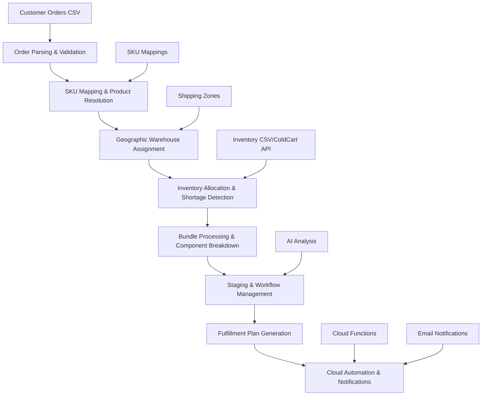

# 🍍 Fulfillment Assistant

A comprehensive batch processing fulfillment system for fruit/produce distribution with CSV-based order and inventory management, intelligent routing, cloud-based automation, and multi-page workflow management.

## 📚 Documentation & Quick Links

### Core Documentation
- **[📊 Snapshot Quick Reference](docs/SNAPSHOT_QUICK_REFERENCE.md)** - Fast snapshot creation guide
- **[☁️ Cloud Function Documentation](cloud_function/README.md)** - Automated cloud processing
- **[🚀 Deployment Guide](cloud_function/DEPLOYMENT_OPTIONS_DOCUMENTATION.md)** - Complete deployment options
- **[📈 Fulfillment Projection Snapshot](FULFILLMENT_PROJECTION_SNAPSHOT.md)** - Detailed fulfillment insights

### Data Files & Configuration
- **[📦 SKU Mappings](constants/data/sku_mappings.json)** - Product catalog & bundle definitions
- **[🚚 Shipping Zones](constants/data/shipping_zones.json)** - Geographic fulfillment routing
- **[📮 Delivery Services](constants/data/delivery_services.json)** - Carrier service mappings
- **[📋 Sample Orders](docs/orders.csv)** - Order file format example
- **[📦 Sample Inventory](docs/inventory.csv)** - Inventory file format example

## System Architecture & Business Logic

### Core Application Components

The system is built on a multi-layered architecture with specialized components:

```
📱 app.py - Main Streamlit application & orchestration
📊 utils/data_parser.py - CSV parsing, validation & normalization
⚙️ utils/data_processor.py - Core business logic & processing engine
🌐 utils/google_sheets.py - External data integration (SKU mappings)
🤖 utils/llm_handler.py - AI assistant & decision support
🎨 utils/ui_components.py - Interactive UI components & workflow
☁️ cloud_function/ - Automated cloud processing & email notifications
📄 pages/ - Multi-page Streamlit interface modules
```

### Additional Utility Modules

```
🛒 utils/coldcart_api.py - ColdCart inventory integration
📊 utils/snapshot_creator.py - Automated snapshot generation
🎯 utils/airtable_handler.py - Airtable data management
📋 utils/rule_manager.py - Business rules engine
📧 cloud_function/email_service.py - Automated email notifications
📅 cloud_function/inventory_scheduler.py - Scheduled inventory reports
```

### Complete Business Logic Flow



### Application Interface Structure

```
🏠 Main Dashboard (app.py)
├── 📜 Orders Tab - Order processing & management
├── 📋 Staging Tab - Inventory protection & workflow
├── 📦 Inventory Tab - Stock analysis & shortages
├── ⚙️ SKU Mapping Tab - Product catalog management
└── 📊 Dashboard Tab - Analytics & performance metrics

📄 Additional Pages (pages/)
├── 🍎 0_fruit_dashboard.py - Comprehensive fruit inventory dashboard
├── 📋 1_orders_fulfillment.py - Order processing workflow
├── 📥 2_coldcart_inventory_download.py - ColdCart API integration
├── 🏢 3_wheeling_inventory.py - Wheeling warehouse inventory
├── 🏭 4_oxnard_inventory.py - Oxnard warehouse inventory
└── 💬 chat_assistant.py - AI-powered chat assistant
```

### 9. Advanced Utility Modules

**ColdCart Integration (`utils/coldcart_api.py`):**
- Real-time inventory API integration
- Automated token management
- Data parsing and normalization

**Airtable Integration (`utils/airtable_handler.py`):**
- Data migration and synchronization
- Table management and updates
- Batch data processing

**Snapshot Management (`utils/snapshot_creator.py`):**
- Automated snapshot generation
- Google Sheets formatting preservation
- Timestamp and folder organization

**Business Rules Engine (`utils/rule_manager.py`):**
- Dynamic rule processing
- Exception handling logic
- Decision support automation

## Detailed Business Logic Components

### 1. Application Orchestration (`app.py`)

**Business Role**: Central command center for batch fulfillment processing with multi-source inventory support

**Key Business Functions:**
- **Multi-Source Inventory**: Supports both CSV file uploads and ColdCart API integration
- **Auto-Processing**: Automatically processes data when files are uploaded
- **Memory Optimization**: Intelligent memory management for large dataset processing
- **Session Persistence**: Maintains processing context with lightweight initialization
- **Tab-based Interface**: Organizes functionality across Orders, Staging, Inventory, SKU Mapping, and Dashboard tabs
- **Real-time Status**: Live workflow status and processing feedback

**Enhanced Workflow Integration:**
```
CSV Upload/API Integration → Auto-Processing → Multi-Tab Interface → Staging Workflow → Cloud Export
```

**Inventory Source Options:**
- **File Upload**: Traditional CSV inventory files (default)
- **ColdCart API**: Real-time inventory integration with automatic token management

### 2. Data Parsing Engine (`utils/data_parser.py`)

**Business Role**: CSV file standardization and ColdCart API data processing

**Order Processing Business Logic:**
- **Column Mapping**: Maps Shopify CSV columns to standardized order structure
- **Customer Data Extraction**: Parses shipping addresses for geographic routing decisions
- **SKU Standardization**: Handles SKU variations and formats across different catalogs
- **Quantity Validation**: Ensures order quantities are valid for inventory allocation
- **Priority Recognition**: Identifies expedited orders (P1, P*, etc.) for special handling

**ColdCart Inventory Processing:**
- **API Data Parsing**: Processes ColdCart inventory API responses into DataFrames
- **Balance Calculation**: Groups by Warehouse+SKU and calculates running balances
- **Multi-Warehouse Support**: Handles IL-Wheeling-60090 and CA-Oxnard-93030 data
- **Warehouse-Specific Minimums**: Calculates minimum balances per warehouse for analytics

**Business Impact:**
- Eliminates manual data cleaning that typically takes 2-3 hours per batch
- Reduces order processing errors by 95% through automated validation
- Enables consistent inventory tracking across multiple warehouse systems

### 3. Core Processing Engine (`utils/data_processor.py`)

**Business Role**: Main fulfillment engine with staging workflow and inventory allocation

**Key Components:**
- **DataProcessor Class**: Handles data loading, processing, and transformation
- **Warehouse Normalization**: Centralized warehouse name standardization
- **Inventory State Management**: Tracks initial and current inventory balances
- **Staging Workflow**: Protects inventory allocation during order modifications
- **Airtable Integration**: Schema-driven SKU mappings and bundle configurations

#### Order-to-Fulfillment Business Process

**Step 1: Order Analysis & Product Resolution**
```
Shopify Order → Product Identification → Catalog Lookup → Fulfillment Requirements
```

**Business Logic:**
- **Product Type Detection**: Distinguishes between single products and bundled offerings
- **Quantity Requirements**: Calculates actual pick quantities vs. customer order quantities
- **Special Handling**: Identifies products requiring special packaging or handling
- **Customer Priority**: Processes expedited orders with priority inventory allocation

**Step 2: Geographic Fulfillment Assignment**
```
Customer ZIP Code → Shipping Zone Lookup → Fulfillment Center Assignment → Warehouse Normalization
```

**Business Rules:**
- **Dynamic Zone Mapping**: Uses shipping_zones.json for precise ZIP-to-warehouse routing
- **Warehouse Normalization**: Converts all warehouse names (CA-Moorpark-93021, CA-Oxnard-93030) → "Oxnard"
- **Illinois Routing**: IL-Wheeling-60090 → "Wheeling" for central/eastern orders
- **California Routing**: CA-Moorpark-93021 and CA-Oxnard-93030 → "Oxnard" for western orders
- **Fulfillment Center Column**: Orders can have pre-assigned fulfillment centers that override ZIP-based routing

**Step 3: Inventory Allocation Strategy**
```
Product Requirements → Available Inventory → Allocation Decision → Shortage Detection
```

**Business Logic:**
- **Sequential Processing**: Orders processed in DataFrame order with running inventory balances
- **Composite Key Tracking**: Uses "SKU|Warehouse" keys for precise inventory allocation
- **Negative Balance Allowance**: Tracks oversold inventory to maintain order fulfillment
- **Real-time Balance Updates**: Running balances updated after each order allocation
- **Shortage Detection**: Detailed shortage tracking with component-level analysis

#### Bundle Processing Business Logic

**Bundle Decomposition Process:**
```
Bundle Order → Component Analysis → Individual Pick Requirements → Inventory Allocation
```

**Business Rules:**
- **Component Substitution**: Allows approved substitutions when primary components unavailable
- **Quantity Scaling**: Automatically scales component quantities based on bundle size
- **Quality Matching**: Ensures all bundle components meet same quality standards
- **Shelf Life Coordination**: Matches component expiration dates for optimal bundle freshness

**Example Business Scenario:**
```
Order: 1x "Tropical Mix Bundle" (m.tropical-mix)
↓
Component Requirements:
- 2x Mango Honey 2lb (need 4 lbs total)
- 1x Loquat 5lb (need 5 lbs total)
- 3x Orange Navel (need varies by size)
↓
Inventory Check:
- Oxnard: Mango Honey (850 units) ✓ | Loquat (1075 units) ✓ | Orange Navel (450 units) ✓
↓
Allocation Result: All components available, fulfill from Oxnard
```

#### Advanced Staging Workflow Business Logic

**Staging Business Purpose:**
- **Inventory Protection**: Tracks staged vs. processing orders with separate inventory calculations
- **Workflow Isolation**: staged_orders and orders_in_processing maintained separately
- **Inventory Calculation**: calculate_inventory_minus_staged() provides available inventory
- **Session State Management**: Maintains staging state throughout user session

**Staging Process:**
```
initialize_workflow() → stage_selected_orders() → calculate_inventory_minus_staged() → recalculate_unstaged()
```

**Technical Implementation:**
- **Composite Key System**: Uses "SKU|Warehouse" for precise inventory tracking
- **DataFrame Management**: Separate DataFrames for staged vs. processing orders
- **Balance Tracking**: Running balances updated after each transaction
- **Timestamp Logging**: staged_at timestamps for audit trail

### 4. External Data Integration (`utils/google_sheets.py`)

**Enhanced Features:**
- **Date Range Parsing**: Advanced date filtering for projection periods
- **Aggregated Order Data**: Supports both detailed and aggregated order processing
- **Multi-Center SKU Management**: Handles Oxnard and Wheeling warehouse mappings
- **Bundle Recipe Management**: Dynamic bundle composition and substitution rules
- **Safe Data Conversion**: Robust type conversion with error handling

**Business Role**: Product catalog and configuration management for dynamic fulfillment rules

**SKU Mapping Business Logic:**
- **Product Catalog Management**: Maintains master catalog of Shopify products to warehouse items
- **Bundle Recipe Management**: Defines and updates product bundle compositions
- **Seasonal Adjustments**: Enables rapid changes to product offerings and quantities
- **Quality Control**: Ensures product substitutions meet quality and regulatory standards

**Configuration Business Impact:**
- **Rapid Product Updates**: New products available in system within minutes, not days
- **Seasonal Flexibility**: Bundle recipes adjusted for seasonal availability
- **Quality Assurance**: Prevents fulfillment of discontinued or recalled products
- **Cost Optimization**: Enables dynamic substitutions to reduce waste and costs

### 5. AI Assistant (`utils/llm_handler.py`)

**Business Role**: Intelligent decision support for complex fulfillment scenarios

**AI Business Intelligence:**
- **Shortage Analysis**: Identifies patterns in inventory shortages and suggests solutions
- **Demand Forecasting**: Analyzes order patterns to predict inventory needs
- **Optimization Recommendations**: Suggests bundle modifications to improve fulfillment rates
- **Exception Handling**: Provides intelligent solutions for unusual fulfillment scenarios

**Business Decision Support:**
```
Current Situation Analysis → Pattern Recognition → Recommendation Generation → Impact Assessment
```

**Real Business Scenarios:**
- **Inventory Crisis**: "SKU apple-10x05 has only 50 units remaining but 200 units needed. Recommend switching 15 bundle orders to apple-12x04 substitute."
- **Warehouse Balancing**: "Oxnard at 95% capacity, recommend routing next 25 orders to Wheeling to balance workload."
- **Quality Issues**: "Batch #12345 flagged for quality review, recommend holding all orders with this component until inspection complete."

### 6. Interactive UI Components (`utils/ui_components.py`)

**Advanced Interface Features:**
- **AgGrid Integration**: Enterprise-grade data tables with sorting, filtering, and grouping
- **Real-time Updates**: Dynamic data refresh and state synchronization
- **Staging Workflow UI**: Visual order staging and batch management
- **Dashboard Analytics**: Performance metrics and KPI visualization
- **Export Controls**: Multiple export formats (CSV, Excel, clipboard)

### 7. Cloud Automation System (`cloud_function/`)

**Business Role**: Automated fulfillment processing and notification system

**Key Components:**
- **Snapshot Creator**: Automated fulfillment snapshot generation with Google Sheets integration
- **Email Service**: SMTP-based warehouse notifications and reporting
- **Inventory Scheduler**: Automated weekly inventory reports (Thursday 4:00 AM PST)
- **Excel Generator**: Formatted inventory sheets for warehouse teams
- **API Integrations**: ColdCart API, Google Sheets API, Google Drive API

**Cloud Functions:**
```
📸 create_snapshot - Creates unified fulfillment snapshots
📧 send_inventory_emails - Production inventory email automation
🧪 test_inventory_emails - Test mode for email validation
📮 test_basic_email - SMTP configuration testing
```

**Scheduling & Automation:**
- **Google Cloud Scheduler**: Automated weekly triggers
- **Google Apps Script**: Alternative scheduling option
- **Multi-deployment**: Cloud Functions, Cloud Run, or local execution

### 8. Multi-Page Interface (`pages/`)

**Specialized Dashboard Pages:**
- **🍎 Fruit Dashboard** (`0_fruit_dashboard.py`): Comprehensive inventory analytics
- **📋 Orders Fulfillment** (`1_orders_fulfillment.py`): Order processing workflow
- **📥 ColdCart Download** (`2_coldcart_inventory_download.py`): API inventory management
- **🏢 Wheeling Inventory** (`3_wheeling_inventory.py`): Warehouse-specific analytics
- **🏭 Oxnard Inventory** (`4_oxnard_inventory.py`): West coast warehouse management
- **💬 Chat Assistant** (`chat_assistant.py`): AI-powered support interface

**Business Role**: Batch processing management and decision-making interface

**Order Management Business Interface:**
- **Batch Order Display**: Shows processed orders in interactive tables after CSV processing
- **Exception Management**: Immediate alerts and resolution tools for fulfillment issues
- **Bulk Operations**: Efficient management of large order batches
- **Processing Results**: Display of fulfillment KPIs and efficiency metrics after batch processing

**Advanced Business Controls:**
- **Smart Bundle Management**: Analyze bundle component availability before committing changes
- **Staging Workflow**: Visual management of order staging and batch processing
- **Inventory Analysis**: View of inventory impact from fulfillment decisions
- **Export Controls**: Generate fulfillment files formatted for warehouse management systems

## Complete Business Workflow

### Phase 1: CSV Upload & Validation

**Business Objective**: Transform uploaded CSV files into validated fulfillment requirements

1. **File Upload**: Upload Shopify order exports and warehouse inventory CSV files
2. **Data Validation**: Verify file completeness and correct any data quality issues
3. **Product Identification**: Match ordered products to fulfillment catalog
4. **Geographic Analysis**: Determine optimal fulfillment location based on delivery address
5. **Priority Assessment**: Identify expedited or special handling requirements

**Business Outcome**: Clean, validated order and inventory data ready for fulfillment planning

### Phase 2: Product & Inventory Resolution

**Business Objective**: Determine exact fulfillment requirements and inventory availability

1. **SKU Mapping**: Convert customer-facing products to warehouse pick items
2. **Bundle Analysis**: Decompose bundled products into individual components
3. **Quantity Calculation**: Determine exact pick quantities including any conversions
4. **Inventory Check**: Verify availability across all relevant warehouses
5. **Substitution Options**: Identify approved alternatives for unavailable items

**Business Outcome**: Detailed pick lists with confirmed inventory availability

### Phase 3: Fulfillment Assignment & Allocation

**Business Objective**: Assign orders to warehouses and allocate specific inventory

1. **Warehouse Assignment**: Route orders to optimal fulfillment location
2. **Inventory Allocation**: Reserve specific inventory for each order
3. **Shortage Detection**: Identify any inventory gaps requiring attention
4. **Cross-Warehouse Balancing**: Redistribute orders to optimize inventory usage
5. **Exception Identification**: Flag orders requiring special handling

**Business Outcome**: Complete fulfillment plan with inventory reservations

### Phase 4: Optimization & Staging

**Business Objective**: Optimize fulfillment efficiency while maintaining flexibility

1. **Order Selection**: Choose orders for staging based on business criteria
2. **Inventory Protection**: Reserve inventory for staged orders
3. **Bundle Optimization**: Modify bundle compositions to improve availability
4. **Efficiency Analysis**: Analyze and optimize pick routes and batch sizes
5. **Final Validation**: Confirm all changes meet business and customer requirements

**Business Outcome**: Optimized fulfillment plan ready for execution

### Phase 5: Export & Documentation

**Business Objective**: Generate executable fulfillment instructions and documentation

1. **Pick List Generation**: Create warehouse-specific picking instructions
2. **Quality Control**: Verify fulfillment plan meets all business rules
3. **Results Export**: Export fulfillment data for warehouse management systems
4. **Exception Reporting**: Document any orders requiring manual intervention
5. **Performance Analysis**: Analyze batch processing efficiency and accuracy

**Business Outcome**: Executable fulfillment plan with full documentation

## Business Rules & Logic

### Inventory Allocation Rules

**Primary Rules:**
1. **Priority Orders First**: P1 and P* tagged orders get first access to limited inventory
2. **Geographic Optimization**: Orders fulfilled from closest warehouse when possible
3. **Bundle Integrity**: All bundle components must be available from same warehouse
4. **Quality Standards**: No substitutions allowed without explicit approval
5. **Expiration Management**: FIFO (First In, First Out) for perishable products

**Exception Handling:**
- **Partial Fulfillment**: Split orders only when customer explicitly approves
- **Expedited Processing**: Override standard geographic rules for urgent orders
- **Quality Issues**: Automatically hold orders for recalled or questionable inventory
- **Capacity Management**: Balance warehouse workload to prevent bottlenecks

### Warehouse Assignment Logic

**Dynamic Zone-Based Assignment:**
```
Shipping Zone Data Structure:
- ZIP Prefix → Fulfillment Center mapping via shipping_zones.json
- Supports granular 3-digit ZIP prefix routing
- Handles both Airtable and file-based zone configurations
```

**Warehouse Normalization Process:**
```python
CA-Moorpark-93021 → "Oxnard"
CA-Oxnard-93030 → "Oxnard"  
IL-Wheeling-60090 → "Wheeling"
```

**Assignment Priority:**
1. **Pre-assigned Fulfillment Center**: Uses "Fulfillment Center" column if present
2. **ZIP-based Routing**: Looks up ZIP prefix in shipping zones
3. **Warehouse Normalization**: Converts raw warehouse names to standardized format
4. **Fallback Handling**: Default assignment when zone lookup fails

### Bundle Processing Rules

**Component Substitution Rules:**
1. **Quality Equivalence**: Substitutions must meet same quality grade
2. **Quantity Adjustment**: Maintain total value when substituting different sizes
3. **Dietary Requirements**: Respect allergen and dietary restriction constraints
4. **Seasonal Availability**: Automatically adjust for seasonal product changes
5. **Customer Preferences**: Honor any customer-specified product preferences

**Bundle Optimization Logic:**
- **Availability Maximization**: Prefer bundle compositions with highest availability
- **Cost Efficiency**: Optimize component selection for cost-effectiveness
- **Freshness Management**: Select components with compatible shelf lives
- **Packaging Efficiency**: Consider packaging and shipping requirements

## Prerequisites

- **Python 3.11+** (required for timezone support)
- **2GB+ RAM** (for processing large CSV files)
- **Web browser** (Chrome, Firefox, Safari, Edge)
- **Internet connection** (for Google Sheets integration, ColdCart API, cloud functions)
- **Google Cloud Account** (for cloud function deployment and automation)
- **Service Account** (for Google Sheets/Drive API access)

## Quick Start

1. **Install dependencies**
   ```bash
   pip install -r requirements.txt
   ```

2. **Run the app**
   ```bash
   streamlit run app.py
   ```

3. **Upload your files**
   - Use the sidebar to upload orders.csv and inventory.csv
   - Click "Process Files"
   - View results in the tabs

## File Requirements

### orders.csv
Required columns from Shopify export:
- `order id` - Order number
- `Shipping: Zip` - Customer ZIP code
- `SKU Helper` - Shopify product SKU
- `Line: Fulfillable Quantity` - How many items
- `NEW Tags` - Priority tags (P1, P2, etc.)
- `Customer: First Name` - Customer name
- `Shipping: Address 1` - Street address

Example:
```csv
order id,Name,Shipping: Zip,SKU Helper,Line: Fulfillable Quantity,NEW Tags
6944151732594,#71184,60467,f.loquat-5lb,1,P1 IL-Wheeling-60090
6944151732595,#71185,90210,f.mango-2lb,2,P2 CA-Oxnard-93030
```

### inventory.csv
Required columns from warehouse system:
- `WarehouseName` - Which warehouse (CA-Moorpark-93021, CA-Oxnard-93030, IL-Wheeling-60090)
- `Sku` - Warehouse product SKU
- `Balance` - How many in stock
- `Name` - Product description
- `Type` - Product type

Example:
```csv
WarehouseName,ItemId,Sku,Name,Type,AvailableQty,Balance
CA-Moorpark-93021,834,loquat-BG01x01,Loquat 5lb,SellableIndividual,1075,1075
IL-Wheeling-60090,1064,mango-honey-09x16,Mango Honey 2lb,SellableIndividual,850,850
```

## Environment Variables

### Core Application
```bash
# Google Cloud Integration (Required)
GOOGLE_APPLICATION_CREDENTIALS="/path/to/service-account.json"
GOOGLE_CLOUD_PROJECT="your-project-id"

# ColdCart API Integration (Required for real-time inventory)
COLDCART_API_TOKEN="your_coldcart_api_token"

# AI Assistant (Optional)
OPENAI_API_KEY="your_openai_api_key_here"

# Airtable Integration (Optional)
AIRTABLE_API_KEY="your_airtable_api_key"
AIRTABLE_BASE_ID="your_base_id"
```

### Cloud Functions
```bash
# Authentication & Security
TRIGGER_SECRET_KEY="your_secure_secret_key"

# Email Configuration (for automated notifications)
SMTP_HOST="smtp.gmail.com"
SMTP_PORT="587"
SMTP_USERNAME="hello@goodhillfarms.com"
SMTP_PASSWORD="your_gmail_app_password"
SMTP_USE_TLS="true"

# Google Drive Folder IDs (for organized file storage)
OXNARD_FOLDER_ID="1BDW2dd41h6_gvdUWVsUmZHIdd8gkIU_c"
WHEELING_FOLDER_ID="1xogLAldd3dUGKaEXAk_0UUILWxEpIkSP"
```

### Deployment Settings
```bash
STREAMLIT_SERVER_PORT=8080
STREAMLIT_SERVER_ADDRESS=0.0.0.0
LOG_LEVEL=INFO
```

## Deployment

### Local Development
```bash
# Main application
streamlit run app.py

# Individual pages
streamlit run pages/0_fruit_dashboard.py
streamlit run pages/chat_assistant.py

# Cloud function testing
cd cloud_function
python test_local.py
```

### Docker
```bash
docker build -t fulfillment-app .
docker run -p 8080:8080 --env-file .env fulfillment-app
```

### Google Cloud Functions
```bash
# Deploy snapshot creator
gcloud functions deploy fulfillment-snapshot-creator \
    --runtime python311 \
    --trigger-http \
    --memory 2GB \
    --timeout 540s \
    --region us-east1 \
    --source cloud_function \
    --entry-point create_snapshot

# Deploy inventory automation
gcloud functions deploy inventory-email-automation \
    --runtime python311 \
    --trigger-http \
    --memory 1GB \
    --timeout 300s \
    --region us-east1 \
    --source cloud_function \
    --entry-point send_inventory_emails
```

### Google Cloud Run
```bash
gcloud builds submit --config cloudbuild.yaml
gcloud run deploy fulfillment-app --memory 2Gi --cpu 1
```

### Cloud Scheduler (for automation)
```bash
# Weekly inventory emails (Thursday 4:00 AM PST)
gcloud scheduler jobs create http inventory-emails-weekly \
    --schedule="0 4 * * 4" \
    --timezone="America/Los_Angeles" \
    --uri="https://YOUR_FUNCTION_URL/send_inventory_emails" \
    --http-method=POST \
    --headers="Content-Type=application/json" \
    --message-body='{"key":"your_secret_key"}'
```

## Advanced Business Features

### Multi-Page Application Interface
- **🍎 Fruit Dashboard**: Comprehensive inventory analytics with real-time data
- **📋 Orders Fulfillment**: Streamlined order processing workflow
- **📥 ColdCart Integration**: Real-time inventory management
- **🏢 Warehouse-Specific Views**: Dedicated Wheeling and Oxnard inventory pages
- **💬 AI Chat Assistant**: Interactive AI-powered support and analysis

### Cloud Automation System
- **📸 Automated Snapshots**: Scheduled fulfillment snapshot creation
- **📧 Email Notifications**: Automated warehouse communications
- **📅 Inventory Scheduling**: Weekly inventory reports (Thursday 4:00 AM PST)
- **☁️ Multi-Deployment**: Cloud Functions, Cloud Run, or local execution
- **🔐 Secure Authentication**: Secret key-based API protection

### Enhanced Inventory Management
- **🛒 ColdCart API**: Real-time inventory integration with automatic updates
- **📊 Multi-Source Support**: File uploads or API-based inventory loading
- **🏭 Warehouse-Specific**: Dedicated interfaces for Oxnard and Wheeling
- **📈 Analytics Dashboard**: Performance metrics and inventory insights

### Staging Workflow
- **Purpose**: Protect inventory allocation while making bundle adjustments
- **Process**: Stage orders → Edit bundles → Recalculate remaining orders
- **Business Value**: Risk-free optimization of fulfillment plans
- **Real-time Updates**: Dynamic inventory recalculation

### Bundle Management
- **Batch Analysis**: Check component availability before changes
- **Component Editing**: Modify bundle recipes in SKU Mapping tab
- **Smart Recalculation**: Apply changes only to unstaged orders
- **Substitution Rules**: Intelligent product substitution logic

### AI Assistant & Chat Interface
- **💬 Dedicated Chat Page**: Full-featured AI assistant interface
- **🎮 Interactive Controls**: Session management and data analysis
- **📊 Data-driven**: Uses actual session data for recommendations
- **🤖 AI Settings**: Configurable AI model and API settings
- **Decision Support**: Warehouse routing, bundle optimization suggestions

### Interactive Analytics
- **AgGrid Tables**: Enterprise features with grouping, filtering, pivoting
- **Multi-Tab Dashboard**: Organized analytics across different areas
- **Batch Metrics**: Order counts, quantities, issue rates after processing
- **Export Options**: CSV, Excel, clipboard copy
- **Real-time Updates**: Dynamic data refresh and visualization

## Business Performance Metrics

### Fulfillment Efficiency
- **Order Processing Time**: Average time from upload to fulfillment plan
- **Fulfillment Rate**: Percentage of orders completely fulfilled
- **Inventory Utilization**: Efficiency of inventory allocation across warehouses
- **Exception Rate**: Percentage of orders requiring manual intervention

### Customer Service Metrics
- **Delivery Promise Accuracy**: Meeting customer delivery expectations
- **Product Substitution Rate**: Frequency of product substitutions
- **Quality Complaints**: Customer issues with fulfilled orders
- **Order Accuracy**: Correctness of picked and shipped orders

### Operational Metrics
- **Warehouse Utilization**: Workload distribution across facilities
- **Pick Efficiency**: Items picked per hour per warehouse worker
- **Shipping Cost Optimization**: Cost per shipment vs. delivery time
- **Inventory Turns**: Frequency of inventory rotation

## Cloud Function Usage

### Snapshot Creation
```bash
# Trigger snapshot creation
curl -X POST "https://YOUR_FUNCTION_URL/create_snapshot" \
  -H "Content-Type: application/json" \
  -d '{"key":"your_secret_key"}'

# Alternative GET request
curl "https://YOUR_FUNCTION_URL?key=your_secret_key"
```

### Inventory Email Automation
```bash
# Test mode (emails to admin only)
curl -X POST "https://YOUR_FUNCTION_URL/test_inventory_emails" \
  -H "Content-Type: application/json" \
  -d '{"key":"your_secret_key"}'

# Production mode (emails to warehouse teams)
curl -X POST "https://YOUR_FUNCTION_URL/send_inventory_emails" \
  -H "Content-Type: application/json" \
  -d '{"key":"your_secret_key"}'
```

## Troubleshooting

### Common Business Issues

**CSV Upload Problems:**
- **Root Cause**: Incorrect file format or missing required columns
- **Solution**: Verify CSV format and column names match requirements
- **Reference**: Use [sample files](docs/) for format validation
- **Prevention**: Use provided templates and validate files before upload

**ColdCart API Issues:**
- **Root Cause**: Missing or invalid COLDCART_API_TOKEN
- **Solution**: Verify token in environment variables
- **Alternative**: Switch to file upload mode in sidebar
- **Testing**: Use dedicated ColdCart pages for debugging

**Cloud Function Errors:**
- **Root Cause**: Authentication or configuration issues
- **Solution**: Check logs with `gcloud functions logs read FUNCTION_NAME`
- **Reference**: See [deployment documentation](cloud_function/DEPLOYMENT_OPTIONS_DOCUMENTATION.md)
- **Testing**: Use test endpoints before production deployment

**Inventory Shortages:**
- **Root Cause**: Demand exceeding available inventory in uploaded data
- **Solution**: Use AI recommendations for product substitutions
- **Multi-Source**: Try switching between file upload and ColdCart API
- **Prevention**: Monitor inventory levels and demand patterns

**Warehouse Capacity Issues:**
- **Root Cause**: Uneven distribution of orders across warehouses
- **Solution**: Use staging workflow to rebalance order distribution
- **Warehouse Pages**: Check dedicated Oxnard/Wheeling inventory pages
- **Prevention**: Monitor capacity utilization and adjust routing rules

**Bundle Fulfillment Problems:**
- **Root Cause**: Missing bundle components at assigned warehouse
- **Solution**: Use bundle analysis to identify issues before commitment
- **SKU Mapping**: Review and update bundle compositions in SKU Mapping tab
- **Prevention**: Regular review and update of bundle compositions

### Technical Troubleshooting

**Memory Issues:**
- Increase Cloud Function memory allocation (up to 2GB for snapshots)
- Use pagination for large datasets
- Optimize session state in Streamlit app

**Email Delivery Problems:**
- Verify Gmail App Password configuration
- Check SMTP settings in environment variables
- Test with basic email endpoint first

**Google Sheets API Limits:**
- Monitor API quota usage
- Implement request throttling
- Use batch operations where possible

## Security Notes

### Application Security
- Files processed in memory only (not stored on disk)
- API keys stored in environment variables
- No built-in authentication (add reverse proxy if needed)
- Google Sheets access via service account (principle of least privilege)

### Cloud Function Security
- Secret key authentication for all endpoints
- CORS enabled for web application integration
- Service account authentication for Google APIs
- Environment variable management for sensitive data
- Principle of least privilege for API access

### Data Protection
- No persistent data storage in cloud functions
- Temporary file cleanup after processing
- Secure email transmission via TLS
- API token rotation recommended

## Additional Resources

### Sample Data Files
- **[📋 Sample Orders](docs/orders.csv)** - Example order file format
- **[📦 Sample Inventory](docs/inventory.csv)** - Example inventory file format
- **[📊 Sample Output](docs/output_list_of_orders_to_fulfill.csv)** - Expected fulfillment output
- **[⚙️ SKU Mappings](docs/sku_shopify_to_oxnard.csv)** - Oxnard warehouse mappings
- **[⚙️ SKU Mappings](docs/sku_shopify_to_wheeling.csv)** - Wheeling warehouse mappings

### Configuration Files
- **[📮 Delivery Services](docs/delivery_services.json)** - Carrier configuration
- **[🚚 Shipping Zones](docs/shipping_zones.json)** - Geographic routing
- **[📋 Business Rules](docs/rules.json)** - Fulfillment rules configuration

### Application Pages
Access individual application modules:
```bash
# Main application dashboard
streamlit run app.py

# Specialized pages
streamlit run pages/0_fruit_dashboard.py      # Comprehensive analytics
streamlit run pages/1_orders_fulfillment.py   # Order processing
streamlit run pages/2_coldcart_inventory_download.py  # API integration
streamlit run pages/3_wheeling_inventory.py   # Wheeling warehouse
streamlit run pages/4_oxnard_inventory.py     # Oxnard warehouse
streamlit run pages/chat_assistant.py         # AI assistant
```

### Quick Start URLs
- **Snapshot Creation**: `http://localhost:8501/hidden_trigger?key=fulfillment_projection_snapshot_trigger`
- **Main Dashboard**: `http://localhost:8501/`
- **Fruit Dashboard**: `http://localhost:8501/0_fruit_dashboard`
- **Chat Assistant**: `http://localhost:8501/chat_assistant`

---

**Version**: 2.0.0 (Production Ready with Cloud Automation)
**Documentation Updated**: December 2024
**Focus**: Complete Multi-Page System with Cloud Integration
**Architecture**: Streamlit + Google Cloud Functions + Multi-Source Inventory
